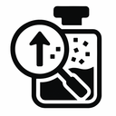

# 제품 추출기 (Product Extractor)

## 개요

제품 추출기는 전문적인 데이터 수집 솔루션으로, 다양한 이커머스 플랫폼에서 제품 정보를 효율적으로 추출하고 관리할 수 있는 크롬 확장 프로그램입니다. 프로그래밍 지식이 없어도 단 몇 번의 클릭만으로 제품 데이터를 수집하여 비즈니스 인사이트를 얻을 수 있습니다.

## 주요 기능

- **원클릭 제품 정보 추출**: 버튼 클릭 또는 단축키(Alt+C)로 현재 페이지의 모든 제품 정보를 즉시 추출
- **누적 데이터 수집**: 여러 페이지를 탐색하며 데이터를 지속적으로 누적 수집 가능
- **다양한 내보내기 옵션**: CSV 또는 JSON 형식으로 제품 정보 내보내기 지원
- **직관적인 UI/UX**: 시각적 피드백과 함께 사용자 친화적인 인터페이스 제공
- **제품 미리보기**: 추출된 제품 정보를 확장 프로그램 내에서 즉시 확인 가능
- **크기 조절 가능한 팝업**: 사용자 필요에 따라 팝업 창 크기 조절 지원
- **다양한 이커머스 플랫폼 지원**: 쿠팡, 아마존, G마켓, 옥션, 11번가, 인터파크, 위메프, 티몬 등 주요 쇼핑몰 지원

## 수집 가능한 데이터

- **제품 ID**: 각 쇼핑몰 시스템 내 고유 식별자
- **제품 제목**: 상품명 전체
- **제품 URL**: 상세 페이지 링크
- **가격 정보**: 현재 판매 가격
- **이미지 URL**: 상품 이미지 주소
- **기타 메타데이터**: 플랫폼별 추가 정보

## 활용 방안

- **경쟁 상품 분석**: 경쟁사 제품 라인업 및 가격 전략 분석
- **가격 동향 파악**: 시장 내 가격 변동 추적 및 분석
- **마케팅 전략 수립**: 데이터 기반 마케팅 인사이트 도출
- **상품 포지셔닝**: 자사 상품의 시장 내 위치 파악
- **리스팅 최적화**: 효과적인 상품 리스팅을 위한 벤치마킹
- **데이터 시각화**: 수집 데이터를 활용한 차트 및 그래프 생성

## 사용 방법

1. **쇼핑몰 접속**: 지원되는 쇼핑몰의 제품 목록 페이지로 이동합니다.
2. **확장 프로그램 실행**: 브라우저 상단의 확장 프로그램 아이콘을 클릭하거나 단축키(Alt+C)를 누릅니다.
3. **데이터 추출**: "제품 정보 추출하기" 버튼을 클릭합니다.
4. **추가 데이터 수집(선택사항)**: 다른 페이지로 이동하여 추가 데이터를 누적 수집할 수 있습니다.
5. **데이터 내보내기**: 수집된 데이터를 CSV 또는 JSON 형식으로 내보냅니다.

## 개인정보 처리 방침

이 확장 프로그램은 사용자의 개인정보를 수집하거나 외부 서버로 전송하지 않습니다. 모든 데이터는 사용자의 브라우저 내에 로컬로 저장됩니다. 자세한 내용은 [extract_product_privacy_policy.html](extract_product_privacy_policy.html) 파일을 참조하세요.

## 권한 사용 이유

- **activeTab**: 현재 탭의 제품 정보를 추출하기 위해 필요합니다.
- **scripting**: 제품 추출 스크립트를 실행하기 위해 필요합니다.
- **storage**: 추출한 제품 정보를 저장하기 위해 필요합니다.
- **notifications**: 추출 완료 또는 오류 발생 시 알림을 표시하기 위해 필요합니다.
- **호스트 권한**: 다양한 쇼핑몰에서 제품 정보를 추출하기 위해 필요합니다.

## 기술 스택

- JavaScript
- Chrome Extension API
- HTML/CSS

## 라이선스

이 프로젝트는 MIT 라이선스 하에 배포됩니다.

---

© 2025 제품 추출기. All Rights Reserved.
